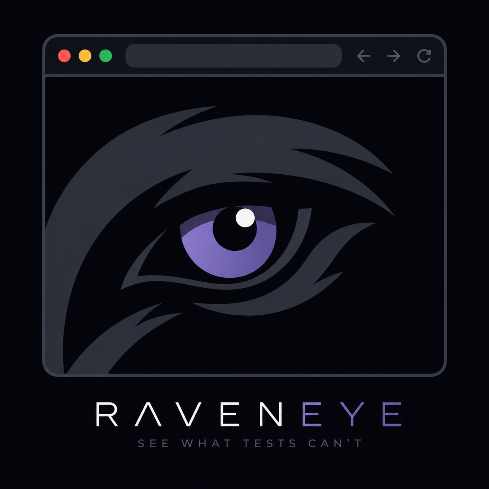

<div align="center">
  

  # RAVENEYE

  **See what tests can't.**

  [](https://www.npmjs.com/package/raveneye-mcp-server)
  [](https://hub.docker.com/r/andrestao577/raveneye)
  [](https://nodejs.org)
  [](LICENSE)

  A shared visible Chromium that **you watch** and **your coding agent controls** — catches broken layouts, hidden elements, console errors, and failed requests that unit tests never will.

</div>

---

## Install

> Requires [Docker Desktop](https://www.docker.com/products/docker-desktop) and Node.js 22+.

**Linux / macOS**
```bash
curl -fsSL https://raw.githubusercontent.com/AndresTaoFlorez/raveneye/main/install.sh | bash
```

**Windows (PowerShell)**
```powershell
irm https://raw.githubusercontent.com/AndresTaoFlorez/raveneye/main/install.ps1 | iex
```

The script pulls the Docker image, installs `raveneye-mcp-server` globally, and registers it in Claude Code. Open a new Claude Code conversation and type `/mcp` — you should see **raveneye** with 11 tools.

### Already have Docker running?

```bash
npm install -g raveneye-mcp-server
claude mcp add raveneye -- raveneye-mcp-server
```

### Uninstall

```bash
# Linux / macOS
curl -fsSL https://raw.githubusercontent.com/AndresTaoFlorez/raveneye/main/uninstall.sh | bash

# Windows
irm https://raw.githubusercontent.com/AndresTaoFlorez/raveneye/main/uninstall.ps1 | iex
```

---

## Local development

```bash
git clone https://github.com/AndresTaoFlorez/raveneye.git && cd raveneye
npm install && npm run build

# Start the stack (builds the Docker image from source)
docker compose build
docker compose up -d

# Verify health
curl http://127.0.0.1:8090/health   # → {"status":"ok"}
```

| URL | What you see |
|-----|-------------|
| `http://127.0.0.1:6080` | Live Chromium via noVNC |
| `http://127.0.0.1:8090/overview` | Dashboard — apps, sessions, missions, docs |
| `http://127.0.0.1:8090/health` | Stack health |

Register the MCP server from source (after `npm run build`):
```bash
# Linux / macOS
claude mcp add raveneye -- node "$(pwd)/apps/mcp-server/dist/index.js"

# Windows (PowerShell)
claude mcp add raveneye -- node "$PWD\apps\mcp-server\dist\index.js"
```

---

## MCP Tools

| Tool | What it does |
|------|-------------|
| `raveneye_observe` | **Start here** — screenshot + console + network in one call |
| `raveneye_screenshot` | Take a screenshot → returns inline PNG |
| `raveneye_navigate` | Navigate to a URL |
| `raveneye_click` | Click a DOM element by CSS selector |
| `raveneye_fill` | Type into an input |
| `raveneye_console` | Read the console log buffer |
| `raveneye_network` | Read network events (pass `problems_only: true` to filter) |
| `raveneye_apps_list` | List registered apps |
| `raveneye_app_open` | Open an isolated session for a registered app |
| `raveneye_status` | Active sessions and current target URL |
| `raveneye_health` | Stack health check |

---

## Agent setup

### Claude Code
```bash
npx raveneye-mcp-server setup claude
```

### Codex
```bash
npx raveneye-mcp-server setup codex
```

### OpenCode / other agents
Add to your MCP config:
```json
{
  "mcpServers": {
    "raveneye": {
      "command": "npx",
      "args": ["--yes", "raveneye-mcp-server"]
    }
  }
}
```

---

## Troubleshooting

**Stack won't start** — check logs:
```bash
docker compose logs -f raveneye
```
Common causes: port conflict on 6080 / 9222 / 8090, Docker not running, insufficient RAM (Chromium needs ~2 GB).

**MCP tools not appearing:**
1. `curl http://127.0.0.1:8090/health` — stack must be up first
2. Restart / reload the agent

**`raveneye_navigate` returns 422** — the hostname isn't in the allowed list. Register the app through the dashboard at `http://127.0.0.1:8090/overview` or add it to `RAVENEYE_ALLOWED_HOSTS` in `.env`.

---

## Documentation

Full docs live in **[docs-vault/](docs-vault/Index.md)** — architecture, mission format, security model, and more. Start with [AGENTS.md](AGENTS.md) if you're an AI agent.
